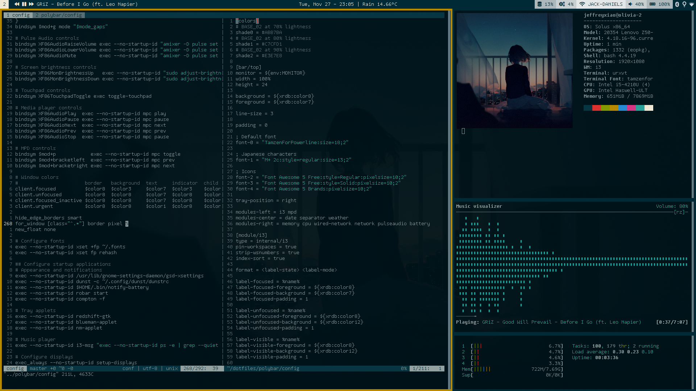

# dotfiles

[](https://opensource.org/licenses/MIT)
[](https://opensource.org/licenses/Apache-2.0)


This repository contains all the dotfiles I use.

## List of Software

```
application launcher → rofi
audio player         → mpc, mpd, ncmpcpp
compositor           → picom
document viewer      → zathura
file manager         → vifm
hotkey daemon        → sxhkd
irc client           → weechat
media player         → mpv
notification daemon  → dunst
shell                → bash
status bar           → polybar
terminal emulator    → rxvt-unicode
terminal multiplexer → tmux
text editor          → nvim
torrent client       → rtorrent
window manager       → bspwm
```

### Code Formatters, Linters, and Language Servers

```
Bash
├─ formatter       → shfmt
└─ linter          → shellcheck

C++
├─ formatter       → clang-format
├─ language-server → clangd
└─ linter          → cppcheck

Elixir
├─ formatter       → mix-format
├─ language-server → elixir-ls
└─ linter          → credo

Go
├─ formatter       → gofmt
└─ language-server → gopls

Java
└─ formatter       → clang-format

JavaScript
├─ formatter       → prettier
├─ language-server → typescript-language-server
└─ linter          → eslint

Python
├─ formatter       → black
├─ language-server → pyright
└─ linter          → autopep, flake8, pylint

Rust
├─ formatter       → rustfmt
├─ language-server → rust-analyzer
└─ linter          → clippy
```

Configuration files are found in [`misc/`](misc/).

## Dependencies

A full list of dependencies and installed software will appear in `install.log` when using the
included bash scripts. Alternatively, you can check [`config.yaml`](config.yaml) to see the
dependencies by package.

## Installation

### With included bash scripts

```
git clone --depth=1 https://github.com/jeffrey-xiao/dotfiles.git
cd dotfiles
git submodule update --init --depth=1
./symlink
./install
```

Any errors with the installation will appear in `install.log`.

### With [`dotinstall`](https://github.com/jeffrey-xiao/dotinstall)

```
git clone --depth=1 https://github.com/jeffrey-xiao/dotfiles.git
cd dotfiles
git submodule update --init --depth=1
pip3 install dotinstall
dotinstall
```

## Color Scheme

The color scheme used is `solarized-dark` and the 16 system colors are set using `.Xresources`. All
configuration files directly use these 16 colors. `dircolors` specifies these colors using 3-bit
ANSI escape codes.

## Personal Configuration

- [`bin/brightness`](bin/brightness): Change the path to the system internals interface for the
  backlight device.
- [`bin/cpu-temperature`](bin/cpu-temperature): Change the path to the system internals interface
  for the thermal device.
- [`bin/init-monitors`](bin/init-monitors): Change the monitor setup.
- [`bin/notify-battery`](bin/notify-battery): Change the path to the system internals interface for
  the power supply device.
- [`bin/robar-brightness-server`](bin/robar-brightness-server): Change the path to the system
  internals interface for the backlight device.
- [`bin/keyboard`](bin/keyboard): Change the keyboard device name.
- [`bin/touchpad`](bin/touchpad): Change the touchpad device name.
- [`bin/record`](bin/record): Change the PulseAudio device names.
- [`git/config`](git/config): Change the username and email.
- [`polybar/config`](polybar/config): Change the adapter and battery name.

## License

`dotfiles` is dual-licensed under the terms of either the MIT License or the Apache License
(Version 2.0).

See [LICENSE-APACHE](LICENSE-APACHE) and [LICENSE-MIT](LICENSE-MIT) for more details.
